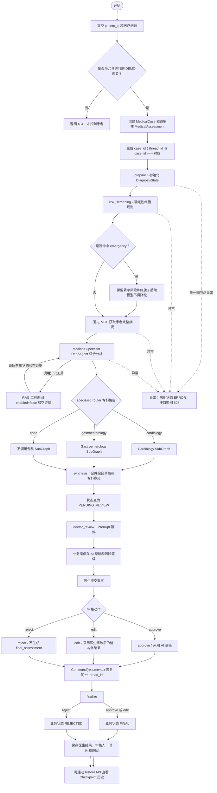
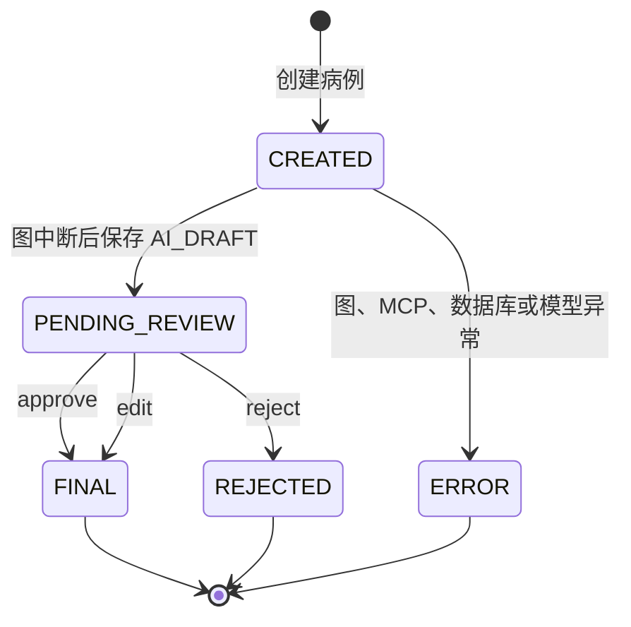
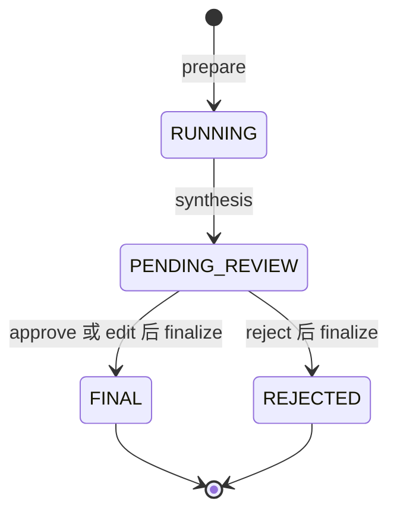
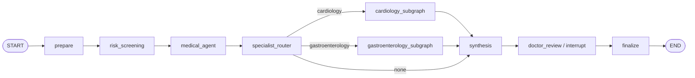
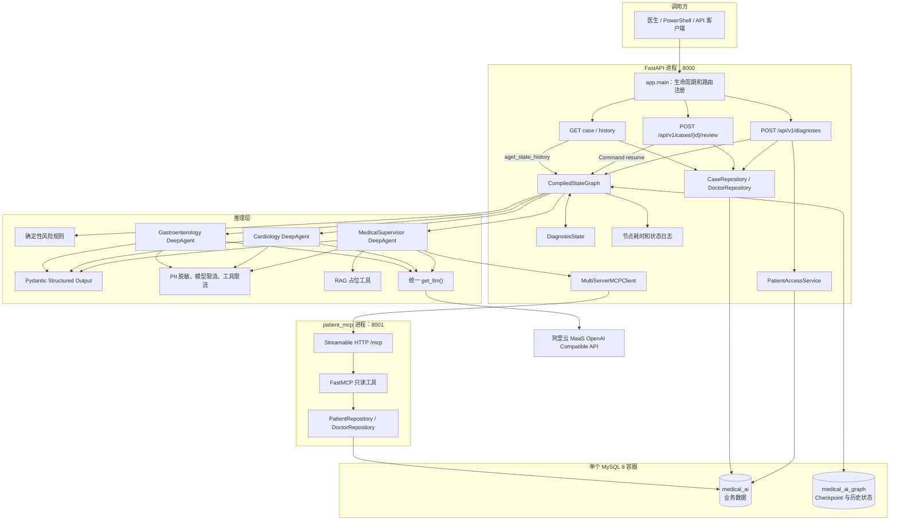
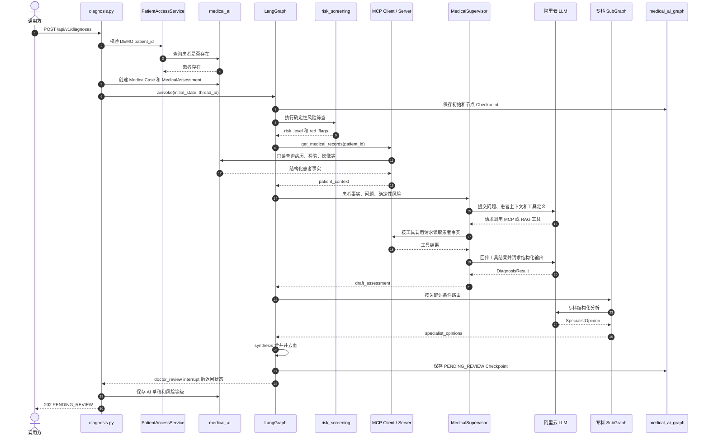
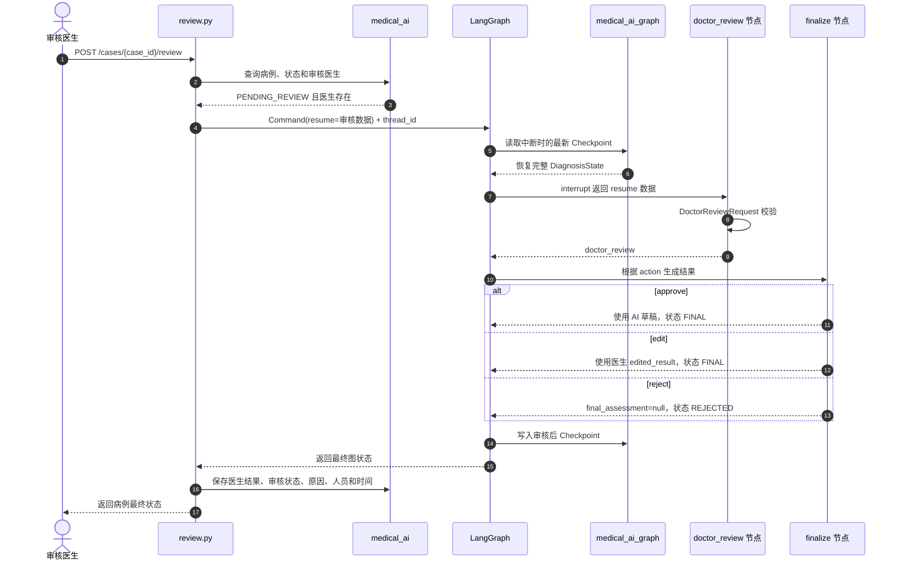
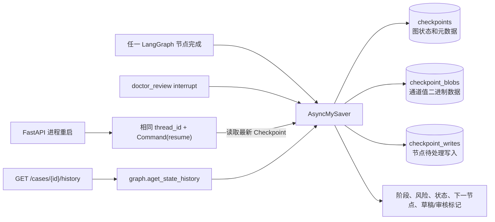
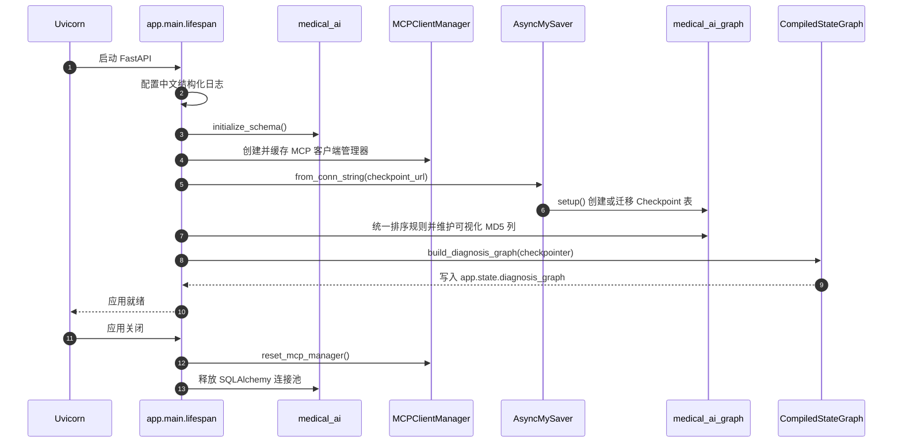

# 医疗辅助多智能体：业务流程与代码技术流程

本文严格依据当前项目代码整理，用于从业务视角和代码视角理解一次医疗辅助诊断如何创建、暂停、审核、恢复、持久化与查询。

> 系统定位：AI 只生成医生辅助决策草稿，不生成无需审核的最终临床诊断。所有数据均为虚构 DEMO 数据。

## 一、整体业务参与者与边界

业务边界：

- 当前只允许访问以 `DEMO-` 开头且确实存在于数据库中的虚构患者。
- AI 只能读取患者数据，不允许通过 MCP 更新病历、删除记录或开具处方。
- 确定性风险规则先于专科智能体运行，高危结果不能被后续模型降级。
- RAG 未配置时诊断流程仍可继续，但结果必须明确 `rag_enabled=false`、`evidence=[]`。
- `doctor_review` 必须触发 LangGraph 中断；只有审核 API 才能恢复流程。

## 二、完整业务流程

## 三、业务状态流转

业务库状态和图内状态是两套相关但不同的状态。业务库不会持久化中间的 `RUNNING`；`RUNNING` 只存在于 Checkpoint 保存的 `DiagnosisState` 中。

### 3.1 `MedicalCase.status` 业务库状态

### 3.2 `DiagnosisState.status` 图内状态

状态与数据的关系：

| 业务状态 | 关键数据 | 含义 |
|---|---|---|
| `CREATED` | `MedicalCase`、空的待审核 `MedicalAssessment` | 病例已经创建，图尚未完成 |
| `RUNNING` | `DiagnosisState.status`，仅保存于 Checkpoint | LangGraph 正在运行，不写入 `MedicalCase.status` |
| `PENDING_REVIEW` | `ai_result_json` | 已生成 AI 草稿，等待医生审核 |
| `FINAL` | `doctor_result_json`、`reviewer_id`、`reviewed_at` | 医生已通过或修改后通过 |
| `REJECTED` | `review_reason`、审核信息 | 医生驳回，不生成最终结果 |
| `ERROR` | 病例状态和后端日志 | 流程异常，客户端只收到安全错误摘要 |

## 四、LangGraph 主图与 SubGraph

### 4.1 主诊断图

主图由 `app/graph/workflow.py` 创建。`StateGraph(DiagnosisState)` 控制确定性流程，DeepAgent 只负责需要模型推理的节点。

### 4.2 两个专科 SubGraph 的共同结构

- 心内科子图调用 `CardiologyAgent`，只分析心血管相关事实。
- 消化科子图调用 `GastroenterologyAgent`，只分析消化系统相关事实。
- 两个子图都不会重新执行主流程，也不会直接读数据库。

## 五、代码技术架构图

## 六、创建诊断请求的代码时序

如果图执行出现异常，接口会把病例状态更新为 `ERROR`，记录内部异常日志，并向客户端返回不包含 traceback 的 503 响应。

## 七、医生审核与中断恢复时序

## 八、Checkpoint 与 Time Travel 技术流程

三个表中的 `checkpoint_ns_hash` 是 Checkpointer 内部使用的 `BINARY(16)` MD5 摘要；`checkpoint_ns_hash_md5` 是项目增加的可视化生成列。二者值一致，但前者必须保留以兼容 Checkpointer 主键和查询。

## 九、应用启动技术流程

`patient_mcp` 是独立进程，需要在 FastAPI 前或同时启动。它通过 Streamable HTTP 暴露八个只读工具，并直接读取 `medical_ai`。

## 十、DiagnosisState 数据流

| State 字段 | 首次写入节点 | 主要消费者 | 作用 |
|---|---|---|---|
| `case_id`、`thread_id` | API 初始状态 | 所有节点、日志、Checkpoint | 关联业务病例和图执行线程 |
| `patient_id`、`user_query` | API 初始状态 | 风险、MCP、Agent、路由 | 诊断输入 |
| `patient_context` | `prepare` 占位，`medical_agent` 写入真实数据 | Supervisor、专科 SubGraph | 来自 MCP 的患者事实 |
| `risk_level`、`red_flags` | `risk_screening` | Supervisor、专科、合成、审核 | 确定性安全结论 |
| `draft_assessment` | `medical_agent`，`synthesis` 更新 | 审核、finalize、API | 结构化 AI 草稿 |
| `intent` | `specialist_router` | 条件边 | 决定进入哪个专科子图 |
| `specialist_context` | 专科子图准备节点 | 专科 Agent | 隔离后的专科输入 |
| `specialist_result` | 专科 Agent 节点 | 专科结果节点 | 单次 `SpecialistOpinion` |
| `specialist_opinions` | `prepare` 初始化，专科子图追加 | `synthesis` | 专科意见集合 |
| `rag_evidence` | `medical_agent` | API、审计 | 当前外部证据；V1 为空 |
| `doctor_review` | `doctor_review` 恢复后 | `finalize` | 医生审核动作和内容 |
| `final_assessment` | `finalize` | review API、业务库 | 审核后的最终结构化结果 |
| `status` | `prepare`、`synthesis`、`finalize` | API、历史查询 | 图内业务状态 |
| `messages` | Agent 交互 | DeepAgents | 仅用于模型交互，不作为业务数据库 |

## 十一、代码模块对应关系

| 业务或技术职责 | 代码入口 |
|---|---|
| FastAPI 应用生命周期 | `app/main.py` |
| 创建诊断接口 | `app/api/diagnosis.py` |
| 病例和历史接口 | `app/api/cases.py` |
| 医生审核与恢复接口 | `app/api/review.py` |
| 主 LangGraph | `app/graph/workflow.py` |
| 可序列化业务 State | `app/graph/state.py` |
| 主图节点 | `app/graph/nodes/` |
| 心内科、消化科 SubGraph | `app/graph/subgraphs/` |
| 三个 DeepAgent | `app/agents/` |
| 结构化诊断输出 | `app/schemas/diagnosis.py` |
| 确定性红旗规则 | `app/safety/risk.py` |
| MCP 客户端复用 | `app/mcp/client.py` |
| MCP 服务和八个只读工具 | `patient_mcp/server.py`、`patient_mcp/tools.py` |
| RAG 占位接口 | `app/rag/retriever.py`、`app/tools/knowledge.py` |
| 业务模型和 Repository | `app/persistence/models.py`、`app/persistence/repositories.py` |
| MySQL Checkpointer | `app/persistence/checkpoint.py` |
| Time Travel 历史摘要 | `app/graph/history.py` |
| PII 和调用次数限制 | `app/middleware/security.py` |
| 节点日志和耗时 | `app/core/observability.py` |

## 十二、推荐阅读路径

理解代码时应始终区分三类数据：

1. `medical_ai` 中的患者事实和业务审核结果；
2. `DiagnosisState` 中一次图执行的可序列化状态；
3. `medical_ai_graph` 中用于恢复和历史查看的 Checkpoint。
